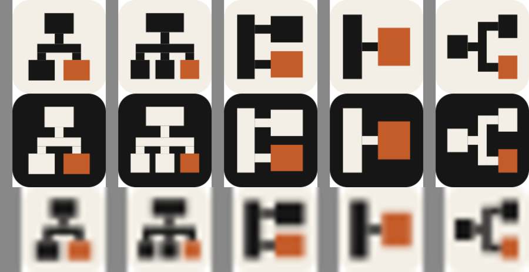
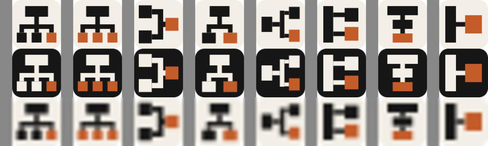

# forkctl mark candidates

All in the connector-graph language — the one that worked in the verctl pass
(`07` merge, `10` fan-out). Same 32-unit grid, corner radius 6, cream/ink/rust.
`sheet.png` is the contact sheet at the size that decides it: 96px light, 96px
dark, then 16px magnified.

## Form studies

Reworks of the chosen `05`, whose form reads as a clenched "C": an orthogonal
split laid out sideways puts the bus *between* upstream and the forks, so it
encloses a counter — a letterform, not a graph. Rotating the split to top-down
dissolves it.

| | | Reading |
|:--|:--|:--|
| `g1` |   | Top-down fan, two forks. Balanced, survives 16px intact. |
| `g2` |   | Top-down fan, three forks, ours rust. Busier; children drop to 6.5 units. |
| `g3` |   | Upstream trunk, two patches off it. Right-heavy; the ink block fuses with the trunk. |
| `g4` |   | One fork off one upstream. Loudest and simplest, borders on abstract. |
| `g5` |   | `05` with blocks equalised and stubs lengthened. Still the "C". |

## First pass

| | | Reading |
|:--|:--|:--|
| `01` |   | One upstream fanning out to three downstreams; ours is the rust one. |
| `02` |   | The same graph with every downstream a fork — mass on the accent row. |
| `03` |   | Upstream and the carried patches converging on one fork. |
| `04` |   | Upstream, two downstreams, one of them ours. Calmer than `01`. |
| `05` |   | The fan turned on its side: upstream left, forks right. |
| `06` |   | Two patches branching off the upstream trunk, the top one rust. |
| `07` |   | The patch stack as a chain, each patch linked to the one below. |
| `08` |   | The minimal statement: one fork off one upstream. Loudest at 16px. |

## At 16px

