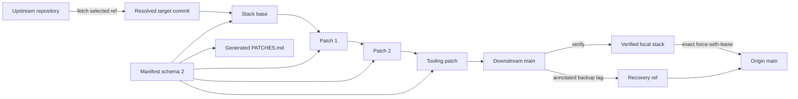

# Forkctl 0.1 — Audited Downstream Fork Control Plane

## Executive decision

Forkctl 0.0.2 is the correct foundation for VSH downstream-fork maintenance. It already centralizes the hardest generic invariants: mise-provisioned tooling, StGit metadata recovery, exact stack identity, fetch-only upstream remotes, declared path drift, required source contracts, deterministic patch exports, and rebase bookkeeping.

Forkctl 0.1 should complete that control plane rather than leaving every consumer to rebuild the same safety scripts. The target contract is:

> A consuming repository declares one ordered downstream patch stack. Forkctl reconstructs it after clone, verifies it fail-closed, rebases it onto an explicitly selected upstream release, records recovery and range-diff evidence, and publishes it only under an exact force-with-lease.

The first complete consumer is the private VSH Zed downstream. Zed should retain application-specific build, semantic test, packaging, and hosting-policy tasks; generic stack mechanics belong in forkctl.

This proposal is intentionally breaking. It introduces manifest schema 2 and should ship as forkctl 0.1.0. Schema 1 remains supported by the immutable 0.0.x releases; 0.1 should reject it with a clear migration message rather than retain a hidden fallback reader.

## Problem statement

A long-lived downstream must answer five questions with evidence:

1. What exact upstream revision is the stack based on?
2. What patches are carried, in what order, and why?
3. Can a clean clone reconstruct the same source tree?
4. Did an upstream rebase preserve each patch's intent?
5. Can publication replace remote history without overwriting someone else's work?

Git and StGit already provide the underlying data model. Forkctl must not replace either. Its role is to declare policy, sequence safe commands, persist audit state, and fail when repository state diverges from the declaration.

## Goals

- Keep Git commits and refs as the canonical repository history.
- Keep StGit as the patch-stack authoring and rebase interface.
- Make every patch's purpose, upstream disposition, and removal condition explicit.
- Support upstream branches, tags, and exact commits without conflating fetch source and rebase target.
- Permit a tooling-only stack before the first product-source patch exists.
- Create immutable recovery evidence before rewriting a published stack.
- Compare the old and new patch series with `git range-diff` after every rebase.
- Publish only with an exact expected remote SHA.
- Deliver all generic operations as immutable remote mise tasks with locked Cargo tools.
- Keep consuming repositories limited to their application-specific checks and hosting policy.
- Prove the workflow against disposable real Git and StGit repositories before release.

## Non-goals

- Reimplement Git revision, merge, conflict, tag, or push semantics.
- Reimplement StGit stack, patch, export, import, or recovery semantics.
- Resolve conflicts automatically.
- Decide which application tests prove semantic compatibility.
- Manage GitHub organization rulesets, repository defaults, or authentication.
- Build, package, sign, or release the downstream application.
- Maintain release-note or product-version policy for consumers.
- Add a general workflow engine; mise remains the task graph.

## Research basis

The design combines upstream tool contracts with practices from mature downstreams.

| Source | Relevant evidence | Design consequence |
|:--|:--|:--|
| [Git push documentation](https://git-scm.com/docs/git-push#Documentation/git-push.txt---force-with-leaseltrefnamegtltexpectgt) | An exact `--force-with-lease=<ref>:<expect>` updates a rewritten ref only when the remote still has the expected value. Bare `--force-with-lease` can be undermined by background fetches that update remote-tracking refs. | Forkctl must capture the remote SHA before mutation and publish with the explicit ref and expected SHA. Plain `--force` is forbidden. |
| [Git range-diff documentation](https://git-scm.com/docs/git-range-diff) | `range-diff` compares two versions of a patch series and pairs corresponding commits by patch similarity. | Every rebase must produce an old-series versus new-series report; the immutable backup tag and published new tip make that comparison reproducible. |
| [Git tag documentation](https://git-scm.com/docs/git-tag) | Annotated tags carry tagger, date, and message; tag creation fails when the name exists unless forced. | Pre-rebase recovery points are annotated, immutable, and never moved. |
| [StGit rebase](https://stacked-git.github.io/man/stg-rebase/) | `stg rebase` pops patches, moves the base, and reapplies them. `--merged` identifies changes already present upstream. | Forkctl delegates replay to `stg rebase --merged` and treats empty merged patches as explicit review items. |
| [StGit export](https://stacked-git.github.io/man/stg-export/) | StGit exports ordered patches as unified diffs with a customizable template containing descriptions, authors, dates, and diffstats. | Persisted exports remain an optional independent reconstruction proof, with a pinned template. |
| [StGit uncommit](https://stacked-git.github.io/man/stg-uncommit/) | `stg uncommit` converts ordinary linear commits into StGit patches without changing the commits. | A clean clone can reconstruct stack metadata from the manifest's declared patch names. |
| [Mise remote tasks](https://mise.jdx.dev/tasks/toml-tasks.html#remote-tasks) | Git-backed remote tasks can be pinned to an immutable ref and are cached locally. | Consumers import one versioned task catalog instead of copying generic scripts. |
| [Mise Cargo backend](https://mise.jdx.dev/dev-tools/backends/cargo.html) | Cargo tools can be installed from crates.io at an exact version and depend on a mise-managed Rust toolchain. | Use `cargo:forkctl` and `cargo:stgit` as repository-local tools; do not require Homebrew or global Cargo installs. |
| [Mise lockfiles](https://mise.jdx.dev/dev-tools/mise-lock.html) | `mise.lock` records exact tool versions; Cargo backend locks are version-level while artifact-rich backends can also lock URLs and checksums. | Commit exact Cargo tool versions and `mise.lock`; rely on Cargo's registry checksum verification for crate payloads. |
| [Zed Preview release process](https://zed.dev/blog/preview-channel) | Zed cuts Preview from main and Stable from Preview on a roughly weekly cadence. | Zed production rebases should select Stable tags explicitly; Preview can inform timing but is not the production base. |
| [Brave Chromium upgrade process](https://github.com/brave/brave-core/blob/master/docs/chromium_version_upgrade.md) | Brave records upstream tag changes, conflict-resolved patches, regenerated patches, and verifies the refreshed patch set. | Base selection, conflict repair, export refresh, and verification are separate auditable stages. |
| [VSCodium patch update process](https://github.com/VSCodium/vscodium/blob/master/docs/howto-build.md#patch-update-process) | VSCodium pauses on failed patches, requires manual correction, regenerates patches, and tests the reconstructed product. | Forkctl must stop at conflicts and leave semantic testing to the consumer. |
| [Ungoogled Chromium development process](https://github.com/ungoogled-software/ungoogled-chromium/blob/master/docs/developing.md#updating-patches) | Its Quilt stack is refreshed in order, failed patches are repaired explicitly, and patch/config validation runs before integration. | Patch order and deterministic reapplication are first-class verification contracts. |
| [Igalia downstream update analysis](https://blogs.igalia.com/dape/2024/09/13/maintaining-chromium-downstream-update-strategies/) | A rebase strategy carries downstream changes as a patch series over an upstream baseline; update cadence should follow upstream release policy, and automation must include application and testing. | Forkctl models a declared baseline and patch series, while consumers define cadence and semantic gates. |

## VSH engineering constraints

Forkctl also follows VSH's established project rules:

- Mise is the repository task and tool entrypoint.
- Runtime tools are exact and repository-local.
- Rust policy code stays small and delegates mechanics to installed CLIs.
- Every state mutation fails closed on dirty, missing, ambiguous, or drifted input.
- No hidden schema migrations or compatibility readers without a live producer and removal condition.
- Generic logic lives in forkctl, not in each consuming fork.
- A fresh clone must contain enough committed guidance and state to recover the workflow without chat history or machine-local configuration.
- Tool output is necessary but not sufficient evidence; reconstructed trees, remote refs, reports, tests, and release artifacts must be inspected.

## Current 0.0.2 baseline

[Forkctl 0.0.2](https://github.com/victor-software-house/forkctl/releases/tag/v0.0.2) already provides a coherent core.

### Covered

- `init` reconstructs StGit metadata from declared commit order.
- `verify` requires a clean worktree.
- The upstream fetch URL must match the manifest.
- The upstream push URL must be `DISABLED`.
- Canonical and stack-base commits must exist.
- The actual StGit base and patch order must match the manifest.
- All patches must be applied.
- Pre-stack and tooling drift must stay within allowlisted paths.
- Required source text must exist.
- Exported source patches must reconstruct the declared source tree in a disposable shared clone.
- `rebase` delegates to `stg rebase --merged`, refreshes exports, updates full base SHAs, stages only declared bookkeeping, and verifies again.
- No-op rebases avoid an unnecessary tooling-patch rewrite.
- Remote mise tasks provision forkctl and StGit without global installation.

### Missing for the complete Zed contract

| Requirement | 0.0.2 limitation |
|:--|:--|
| Stable-tag targeting | Upstream `ref` is treated as `remote/branch`; fetch and rebase target are coupled. |
| Tooling-only bootstrap | `source_top()` requires at least one exported source patch. |
| Patch audit metadata | Patch entries contain only `name` and optional `export`. |
| Human ledger | `PATCHES.md` is not derived or verified. |
| Recovery point | Rebase creates no immutable backup tag. |
| Rebase evidence | Old base/tip are not retained and no range-diff is produced. |
| Branch contract | Downstream remote and branch are not declared or verified. |
| Publication | No exact-lease push operation exists. |
| Real workflow proof | Tests do not exercise init, verify, or rebase in a disposable StGit repository. |
| Portable task delivery | The GitHub release backend currently has only a macOS arm64 native asset. |

## Target operating model



The downstream branch remains ordinary Git history. StGit metadata is recoverable state, not a remote-only source format. The manifest is the structured declaration; `PATCHES.md` is its deterministic human projection.

## Manifest schema 2

The following shape is complete enough for Zed and remains generic across Git hosts.

```json
{
  "schema": 2,
  "downstream": {
    "remote": "origin",
    "branch": "main",
    "backup_tag_prefix": "vsh/pre-sync"
  },
  "upstream": {
    "remote": "upstream",
    "url": "https://github.com/zed-industries/zed.git",
    "follow_ref": "refs/heads/main"
  },
  "target_policy": {
    "allowed_ref_patterns": ["refs/tags/v*"],
    "required": [
      {
        "path": "crates/zed/RELEASE_CHANNEL",
        "contains": "stable"
      }
    ]
  },
  "bases": {
    "label": "refs/tags/v1.13.2",
    "canonical": "5cdb7ab9d9546db683132cfa78e68acec3064cac",
    "stack": "5cdb7ab9d9546db683132cfa78e68acec3064cac"
  },
  "ledger": "PATCHES.md",
  "bookkeeping_patch": "fork-maintenance",
  "patches": [
    {
      "name": "fork-maintenance",
      "kind": "tooling",
      "purpose": "Define the audited fork maintenance contract and tool entrypoints.",
      "upstream_status": "inappropriate: private downstream operations",
      "drop_when": "The downstream fork is retired.",
      "paths": [
        "FORK.md",
        "mise.toml",
        "mise.lock"
      ]
    },
    {
      "name": "application-identity",
      "kind": "source",
      "purpose": "Give the downstream app a distinct identity and user-data root.",
      "upstream_status": "not-submitted",
      "drop_when": "Upstream exposes complete downstream identity configuration.",
      "paths": [
        "crates/paths/src/paths.rs",
        "crates/release_channel/src/lib.rs",
        "crates/zed/Cargo.toml"
      ],
      "export": "patches/source/0001-application-identity.patch"
    }
  ],
  "allow": {
    "base": []
  },
  "required": [
    {
      "path": "FORK.md",
      "contains": "mise run fork:verify"
    }
  ]
}
```

### Schema rules

- Unknown fields are rejected.
- Full persisted commit identities are 40-character hexadecimal SHAs.
- `downstream.remote`, `downstream.branch`, upstream identity, patch names, and ledger path are required.
- Patch names are unique, non-empty, and whitespace-free.
- `kind` is `source` or `tooling`.
- Source patches may export; tooling patches do not need to export.
- Export paths are optional globally. If present, they are repository-relative and unique.
- Every patch has non-empty `purpose`, `upstream_status`, `drop_when`, and at least one allowed path.
- Base allowlists and patch paths use the existing non-directory-crossing glob semantics.
- The manifest and ledger paths are implicit bookkeeping paths and are not repeated in patch `paths`.
- The declared `bookkeeping_patch` exists, is the final tooling patch, and owns manifest, ledger, base-pin, and export-bookkeeping changes.
- The ledger path, export paths, and required paths cannot escape the repository.
- A tooling-only stack is valid.
- A source patch may not follow a tooling patch unless a future schema explicitly defines mixed-layer reconstruction. Keeping source patches before tooling preserves a clear reconstructed product boundary.

## Canonical patch metadata

Each patch's manifest metadata must match trailers in its Git commit message:

```text
Downstream-Reason: Give the downstream app a distinct identity and user-data root.
Upstream-Status: not-submitted
Drop-When: Upstream exposes complete downstream identity configuration.
```

Forkctl should compare normalized values exactly. Missing, duplicated, or conflicting trailers are verification failures.

`PATCHES.md` is generated from manifest order and patch metadata. It deliberately omits commit hashes: the bookkeeping patch contains the ledger, so embedding that patch's own hash would be self-referential. `forkctl status` resolves live patch commits when needed. A deterministic table is sufficient:

```markdown
| Order | Patch | Purpose | Upstream status | Drop condition |
|--:|:--|:--|:--|:--|
| 1 | `fork-maintenance` | ... | ... | ... |
```

The generated document must include the resolved base label and SHA, generation command, and warning that the manifest is canonical. `verify` renders to memory and fails if the tracked ledger differs byte-for-byte. The final bookkeeping patch owns ledger and manifest changes from `new` and `rebase`.

## Command contract

The public operations become `init`, `status`, `new`, `verify`, `rebase`, `publish`, and `instructions`.

### `forkctl init`

Purpose: recover a declared stack after clone.

Contract:

1. Require a clean worktree and declared downstream branch.
2. Add or verify the upstream fetch URL.
3. Set the upstream push URL to `DISABLED`.
4. Fetch the upstream follow ref and current base label.
5. If the StGit series already matches, run `verify` and exit.
6. If no StGit series exists, initialize StGit and convert the declared number of ordinary linear commits with `stg uncommit`.
7. Reject merge commits, extra commits, wrong order, or a partially initialized foreign stack.
8. Render/verify the ledger and run full verification.

`stg uncommit` accepts only single-parent commits, so the declared downstream patch stack must remain linear.

### `forkctl status`

Purpose: explain state without mutation.

Output:

- repository root;
- current and declared branch;
- downstream remote SHA and captured lease SHA;
- upstream follow ref;
- base label, canonical SHA, and stack-base SHA;
- ordered applied/unapplied patches;
- exported patch paths;
- dirty paths;
- pending rebase report and backup tag;
- verification summary.

Human output is concise. `--json` returns a stable machine-readable object for mise tasks and CI.

### `forkctl new`

Purpose: create one fully documented patch.

Suggested interface:

```sh
forkctl new application-identity \
  --kind source \
  --purpose "Give the downstream app a distinct identity and user-data root." \
  --upstream-status "not-submitted" \
  --drop-when "Upstream exposes complete downstream identity configuration." \
  --path crates/paths/src/paths.rs \
  --path crates/release_channel/src/lib.rs \
  --export patches/source/0001-application-identity.patch
```

Contract:

1. Verify the existing stack and require no pending rebase.
2. Capture the exact downstream remote SHA as the publication lease.
3. Determine the layer-correct insertion point: source patches follow the last source patch; other tooling patches precede the final bookkeeping patch.
4. Use StGit to create and place the patch with matching trailers while keeping the bookkeeping patch last.
5. Append the manifest entry atomically and render the ledger.
6. Stage only manifest and ledger bookkeeping.
7. Refresh the final bookkeeping patch, not the new source patch, with that bookkeeping.
8. Leave implementation edits to the operator.

The patch is intentionally valid but incomplete until its declared implementation changes are added. `verify` may fail a source patch whose implementation paths are empty; `status` remains available.

### `forkctl verify`

Purpose: prove structural reproducibility and declared intent.

Required checks:

- clean worktree;
- current branch equals `downstream.branch`;
- origin fetch/push URL exists;
- upstream fetch URL matches and push URL is `DISABLED`;
- persisted bases and labels resolve to expected commits;
- StGit base equals `bases.stack`;
- patch order exactly matches the manifest;
- no patch is unapplied;
- every patch's diff touches only its declared paths;
- every patch's commit trailers match manifest metadata;
- base drift stays within `allow.base`;
- required source contracts hold;
- tracked exports match fresh StGit exports;
- persisted exports reconstruct the expected source tree when exports are configured;
- tooling-only stacks reconstruct to the stack-base tree;
- generated ledger matches the tracked ledger;
- Git-private pending rebase state, when present, names the current stack and recovery tag;
- no undeclared generated files are staged.

Structural verification does not claim semantic compatibility. Consumer checks run afterward.

### `forkctl rebase --onto <ref>`

Purpose: replay the complete declared series onto an explicitly selected upstream revision and produce durable evidence.

The recommended input is a full ref such as:

```sh
forkctl rebase --onto refs/tags/v1.14.0
```

Algorithm:

1. Run `verify`.
2. Query `refs/heads/<downstream>` on the downstream remote and save the exact SHA in Git-private forkctl state.
3. Capture old base and old tip.
4. Fetch the upstream follow ref without indiscriminately fetching all tags.
5. Fetch the requested target into `FETCH_HEAD` and resolve `FETCH_HEAD^{commit}`.
6. Verify the target ref pattern and required target-tree contracts.
7. Compute the canonical merge base against the upstream follow ref.
8. If the target SHA already equals the stack base, verify, report a no-op, and return without creating a tag or rewriting any patch.
9. Create a unique annotated local backup tag using the configured prefix, date, and old-tip abbreviation. Refuse to move an existing tag.
10. Run `stg rebase --merged <target-sha>`.
11. Stop on conflict and preserve normal StGit conflict state plus the backup tag.
12. Refresh declared exports atomically.
13. Update base label and full SHAs.
14. Render the ledger.
15. Refresh the final bookkeeping patch only when bookkeeping changed.
16. Run full structural verification.
17. Generate `git range-diff --no-color old-base..old-tip new-base..new-tip`.
18. Write the review report under `.git/forkctl/rebases/`; do not add it to the patch stack.
19. Print the report path, backup tag, semantic checks still required, and publication command.

The command does not update the downstream branch remotely. The range-diff report stays Git-private to avoid changing the patch it describes; after publication, the immutable backup tag and new branch tip reproduce the comparison exactly.

### Rebase report

A local report contains:

- UTC/BRT-independent commit identities and ref labels;
- old/new base and tip SHAs;
- backup tag;
- patches retained, changed, emptied as upstream-merged, added, or removed;
- no-color range-diff in a fenced block;
- regenerated export list and hashes;
- structural verification result;
- explicit statement that semantic tests and publication remain pending.

The report is review evidence, not tracked patch content and not approval. An operator reviews it before running consumer checks and publish. Forkctl verifies that its recorded old/new refs still match; the pushed recovery tag preserves the old series after publication.

### Conflict recovery

Forkctl must not interpret conflict content. It prints the documented StGit recovery sequence:

```sh
mise x -- stg add --update
mise x -- stg refresh
mise x -- stg goto <top-patch>
mise run fork:verify
```

The backup tag allows a complete reset. `forkctl status` must identify interrupted rebase state and the recovery ref.

### `forkctl publish`

Purpose: replace the declared downstream branch without overwriting unexpected remote work.

Preconditions:

- full structural verification passes;
- a captured expected remote SHA exists;
- current remote SHA still equals that expected SHA;
- pending rebase report, when present, matches HEAD;
- backup tag does not already exist remotely at another object.

Publication uses an atomic Git push when supported:

```sh
git push --atomic origin \
  <backup-tag>:<backup-tag> \
  main:main \
  --force-with-lease=refs/heads/main:<expected-sha>
```

This combines the recovery tag and rewritten branch update. If the host rejects atomic push, forkctl fails without retrying non-atomically; a future explicit policy may allow a documented fallback.

On success, forkctl verifies both remote refs with `git ls-remote` and clears the Git-private pending lease/rebase state. It never uses plain `--force`.

### `forkctl instructions`

The generated contract remains available outside a repository. It must describe the schema-2 workflow, conflict recovery, consumer check boundary, exact-lease publication, and source-of-truth hierarchy.

## Tooling-only stacks

A downstream may need governance, build, identity, or packaging tooling before its first source patch. Schema 2 therefore permits no exported patches.

Verification behavior:

- source top defaults to `bases.stack`;
- reconstructed source tree is the stack-base tree;
- every tooling patch is verified against its own declared paths;
- ledger, manifest, guidance, and task changes remain fully auditable;
- when the first source patch is added, it must be inserted before tooling patches.

Insertion can use StGit reordering. The manifest and ledger order change in the same tooling refresh.

## Export policy

Persisted exports are optional, not a second canonical implementation.

- Git commits remain canonical.
- Manifest entries declare which source patches require independent exports.
- Forkctl generates exports from StGit using its pinned template.
- Verification regenerates them in memory and compares bytes.
- Reconstruction imports only declared exports into a clean base and compares the resulting tree with the last exported source patch's tree.
- Tooling patches normally remain unexported because they operate on fork-owned governance and build files rather than product source.

This preserves the strongest part of 0.0.2 without requiring meaningless source exports from a tooling-only stack.

## Mise task catalog

Consumers should not install StGit or forkctl globally.

Recommended consumer configuration:

```toml
min_version = "2026.8.0"

[settings]
experimental = true
lockfile = true

[env]
FORK_MANIFEST = "patches/fork.json"

[tools]
rust = "1.97.1"
"cargo:stgit" = { version = "2.6.1", depends = ["rust"] }
"cargo:forkctl" = { version = "0.1.0", depends = ["rust"] }

[task_config]
includes = [
  "git::https://github.com/victor-software-house/forkctl.git//tasks/fork.toml?ref=v0.1.0",
  "mise-tasks"
]
```

The repository commits the resulting `mise.lock`. Cargo-backed entries are version-level locks; Cargo validates crates.io package checksums during installation.

Remote tasks:

| Task | Operation | Mutation |
|:--|:--|:--|
| `fork:init` | Recover metadata and verify | Local metadata |
| `fork:status` | Explain declared and actual state | None |
| `fork:new` | Create a documented patch | Local stack and manifest |
| `fork:verify` | Structural gate | None |
| `fork:rebase` | Rebase and generate evidence | Local stack and Git-private review state |
| `fork:publish` | Exact-lease atomic publication | Downstream remote |

Task descriptions must state requirements, side effects, and phase. `fork:publish` depends on `fork:verify`; consumers add semantic tasks as dependencies or wrap publication with a local aggregate task.

## Generic versus consumer-owned responsibilities

| Forkctl owns | Consumer owns |
|:--|:--|
| Manifest schema and validation | Product-specific target policy values |
| StGit initialization and order | Product source changes |
| Patch metadata and ledger generation | Semantic unit/integration/UI tests |
| Path and source-contract checks | Build, packaging, signing, notarization |
| Exports and deterministic reconstruction | Release version and product changelog |
| Backup refs, range-diff generation, and exact-lease publication | Hosting authentication, organization rulesets, and approval to ship |
| Mise remote task catalog | Local application task DAG |

Forkctl remains Git-host agnostic. A Zed-specific mise task may verify that its GitHub organization ruleset permits the declared rebase policy, but that API check does not belong in the generic binary.

## Zed migration

Do not adopt 0.0.2 and then patch around its gaps. Implement and release 0.1.0 first.

Migration sequence:

1. Release forkctl 0.1.0 with schema 2 and the complete integration suite.
2. Add `patches/fork.json` to Zed's existing `fork-maintenance` patch.
3. Declare Zed's `origin/main`, upstream identity, Stable-tag target policy, current `v1.13.2` base, tooling patch metadata, allowed paths, and required guidance text.
4. Render `PATCHES.md` from the manifest and compare it with the existing ledger.
5. Pin `cargo:forkctl`, `cargo:stgit`, Rust, and the `v0.1.0` remote task catalog in Zed's mise configuration and lockfile.
6. Replace repository-local generic tasks with forkctl tasks.
7. Retain Zed-local tasks for macOS bundle creation, terminal tests, semantic checks, and the GitHub ruleset-exception assertion.
8. Run `fork:init` in a disposable clone of Zed's private main branch.
9. Run `fork:verify` in both the durable and disposable clones.
10. Perform a no-op rebase to the existing Stable tag and require byte-identical exports, manifest, ledger, patch commits, and reproducible comparison refs.
11. Perform a rehearsal rebase in a disposable clone onto the next available Stable tag; review range-diff and build the macOS bundle.
12. Publish only after exact-lease rejection and success paths have both been exercised against a disposable remote.

After migration, Zed should have no generic fork-control shell logic.

## Test strategy

Unit tests remain useful for schema, paths, patterns, rendering, command construction, and state transitions. They are insufficient for the Git/StGit contract.

### Disposable integration harness

Each integration test creates:

- a bare upstream remote;
- a bare downstream remote;
- an upstream working repository with branches and annotated release tags;
- a downstream clone with one or more ordinary patch commits;
- a schema-2 manifest and generated ledger;
- repository-local Git identity;
- real `git` and `stg` commands from the mise environment.

### Required scenarios

| Scenario | Required proof |
|:--|:--|
| Clean clone initialization | Patch names, base, trees, trailers, and ledger verify after `init`. |
| Already initialized clone | `init` is idempotent and commit-stable. |
| Dirty worktree | Every mutating or verification command fails before state changes. |
| Wrong branch | Verify, new, rebase, and publish fail. |
| Upstream push enabled | Verify fails until push URL is `DISABLED`. |
| Tooling-only stack | Initialization and reconstruction succeed without exported source patches. |
| Path drift | A patch touching an undeclared file fails. |
| Metadata drift | Manifest, commit trailers, or ledger mismatch fails. |
| Export drift | Byte mismatch and reconstructed-tree mismatch fail independently. |
| No-op rebase | Base, commits, exports, ledger, and manifest remain unchanged; report states no patch change. |
| Changed clean rebase | Base pins and exports update; range-diff pairs all intended patches. |
| Upstream-merged patch | `--merged` leaves an empty patch that must be explicitly cleaned or retained; verification reports it. |
| Rebase conflict | Command stops, backup tag exists, no publish state is cleared, and recovery instructions are accurate. |
| Invalid target | Ref pattern or target-tree contract rejects before rebase. |
| Remote advances during work | Publish fails exact lease and leaves remote refs untouched. |
| Successful publish | Branch and backup tag update atomically and are verified through `ls-remote`. |
| Existing conflicting backup tag | Rebase fails rather than moving it. |
| Fresh consumer via remote mise catalog | Locked install, task discovery, init, verify, and no-op rebase work without global tools. |

### Consumer proof

Every forkctl release must be tested from an immutable remote task reference against a disposable real consumer. Zed becomes the primary high-value proof after 0.1.0, but the release gate should retain a small synthetic fixture so forkctl development does not require the large Zed checkout.

## Distribution and versioning

### Version

Use 0.1.0 because schema 2 and new command contracts are intentionally breaking.

### Binary delivery

Use `cargo:forkctl@0.1.0` in remote tasks for immediate platform portability. Forkctl is already published to crates.io, and the task already provisions Rust. Native release assets may be added later as an optimization, but the task catalog must not claim unsupported platforms while publishing only macOS arm64.

### Version synchronization

`[workspace.package].version` remains the sole source. The existing xtask synchronizes the version embedded in `tasks/fork.toml` and `examples/mise.toml`; verification rejects drift.

### Release gate

1. `mise install --locked`
2. `mise run verify`
3. `mise run build`
4. Package dry-run and crates.io publication checks
5. Disposable synthetic consumer proof through the tagged remote catalog
6. Zed rehearsal when the manifest contract changes
7. Publish crate and immutable Git tag
8. Verify crates.io metadata, release ref, remote task retrieval, and installed `forkctl --version`

## Implementation phases

### Phase 1 — Schema and verification

- Introduce schema 2 types.
- Add downstream identity, target policy, patch metadata, per-patch paths, ledger, and bookkeeping-patch settings.
- Support tooling-only stacks.
- Verify branch, metadata trailers, per-patch paths, ledger, and optional exports.
- Add deterministic ledger rendering.

### Phase 2 — Targeted rebase evidence

- Add `rebase --onto` target resolution.
- Validate target refs and target-tree contracts.
- Capture lease state and create annotated backup tags.
- Rebase, refresh exports/base pins/ledger, and preserve no-op stability.
- Generate Git-private range-diff review output and preserve the refs needed to reproduce it.
- Add interrupted-rebase status and recovery guidance.

### Phase 3 — Lifecycle and publication

- Add `status --json`.
- Add documented `new`.
- Add exact-lease atomic `publish`.
- Update instructions and remote mise tasks.
- Move task delivery to `cargo:forkctl`.

### Phase 4 — Integration proof and Zed adoption

- Build the disposable Git/StGit harness.
- Cover every required scenario.
- Publish 0.1.0.
- Migrate Zed and delete its generic local fork scripts.
- Run no-op and next-Stable rehearsal rebases.

## Acceptance criteria

Forkctl 0.1 is complete when all of the following hold:

- A clean Zed clone can recover its stack from ordinary Git commits and schema-2 state.
- A tooling-only stack verifies before the first source patch.
- The manifest, commit trailers, StGit order, per-patch paths, exports, and generated ledger cannot drift silently.
- `rebase --onto refs/tags/<stable>` validates and records the exact target commit.
- Every rebase creates an immutable annotated recovery tag before replay.
- Every rebase emits a no-color range-diff and publishes immutable refs that reproduce it.
- A no-op rebase changes no patch commit or bookkeeping file unnecessarily.
- Publication uses an exact expected SHA and rejects a concurrently advanced remote.
- A successful publication updates the branch and backup tag atomically and verifies both remotely.
- No generic Git/StGit fork-control script remains in Zed.
- Zed-specific build, terminal, packaging, and hosting checks remain outside forkctl.
- The full unit, integration, remote-catalog consumer, and repository verification gates pass from a clean environment.
- README, examples, generated instructions, task catalog, and manifest schema describe one consistent workflow.

## Rejected alternatives

### Keep Zed's local scripts indefinitely

Rejected because generic branch, stack, ledger, rebase, and publication logic would immediately have two implementations. Drift would be inevitable, and forkctl's purpose is to centralize exactly that contract.

### Adopt 0.0.2 and wrap its missing behavior in Zed

Rejected because Stable-tag resolution, backup tags, range-diff, metadata, tooling-only stacks, and exact-lease publication are generic requirements. Consumer wrappers would become the real control plane.

### Make exported patch files canonical

Rejected because Git commits remain the universal history and StGit patches are ordinary commits. Exports are valuable reconstruction evidence, not the primary editable source.

### Track upstream main for production

Rejected for Zed because its documented Preview and Stable channels provide a predictable release cadence. Production rebases should use Stable tags; Preview may be used for rehearsal.

### Publish with bare `--force-with-lease`

Rejected because Git documents that background fetches can update remote-tracking refs and weaken the assumption behind the implicit lease. Forkctl must use the explicit expected SHA form.

### Put GitHub rulesets into forkctl core

Rejected because the CLI is Git-host agnostic and organization policy requires separate authentication and authorization. Consumer hosting checks remain mise tasks outside the binary.

## Sources

### Primary tool contracts

- [Git push and exact force-with-lease](https://git-scm.com/docs/git-push#Documentation/git-push.txt---force-with-leaseltrefnamegtltexpectgt)
- [Git range-diff](https://git-scm.com/docs/git-range-diff)
- [Git annotated tags](https://git-scm.com/docs/git-tag)
- [StGit rebase](https://stacked-git.github.io/man/stg-rebase/)
- [StGit export](https://stacked-git.github.io/man/stg-export/)
- [StGit uncommit](https://stacked-git.github.io/man/stg-uncommit/)
- [Mise remote tasks](https://mise.jdx.dev/tasks/toml-tasks.html#remote-tasks)
- [Mise Cargo backend](https://mise.jdx.dev/dev-tools/backends/cargo.html)
- [Mise lockfiles](https://mise.jdx.dev/dev-tools/mise-lock.html)

### Downstream practice

- [Zed Preview and Stable release process](https://zed.dev/blog/preview-channel)
- [Brave Chromium version upgrades](https://github.com/brave/brave-core/blob/master/docs/chromium_version_upgrade.md)
- [VSCodium patch update process](https://github.com/VSCodium/vscodium/blob/master/docs/howto-build.md#patch-update-process)
- [Ungoogled Chromium patch workflow](https://github.com/ungoogled-software/ungoogled-chromium/blob/master/docs/developing.md#updating-patches)
- [Igalia analysis of Chromium downstream update strategies](https://blogs.igalia.com/dape/2024/09/13/maintaining-chromium-downstream-update-strategies/)

### Forkctl baseline

- [Forkctl repository](https://github.com/victor-software-house/forkctl)
- [Forkctl 0.0.2 release](https://github.com/victor-software-house/forkctl/releases/tag/v0.0.2)
- [Current manifest schema](https://github.com/victor-software-house/forkctl/blob/v0.0.2/src/manifest.rs)
- [Current verification implementation](https://github.com/victor-software-house/forkctl/blob/v0.0.2/src/app/verify.rs)
- [Current rebase implementation](https://github.com/victor-software-house/forkctl/blob/v0.0.2/src/app/rebase.rs)
- [Current remote mise task catalog](https://github.com/victor-software-house/forkctl/blob/v0.0.2/tasks/fork.toml)
